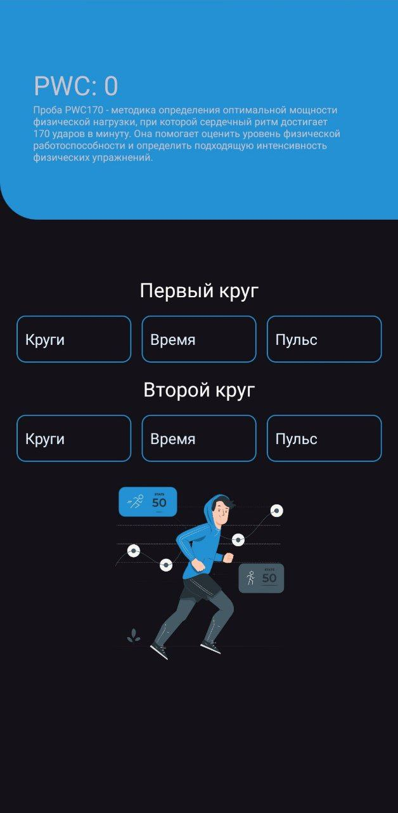

# Fitness Calc

This Android application is designed to assist in calculating the PWC 170 test, aiding fitness enthusiasts, athletes,
and professionals in evaluating their cardiovascular endurance. The PWC 170 (Physical Work Capacity at a heart rate of
170 beats per minute) test is widely used as an indicator of aerobic fitness and endurance.

---

Acknowledgments:

We extend our gratitude to all contributors, open-source libraries, and resources that have facilitated the development
of this application, making it possible to offer a valuable tool for fitness assessment and improvement.
